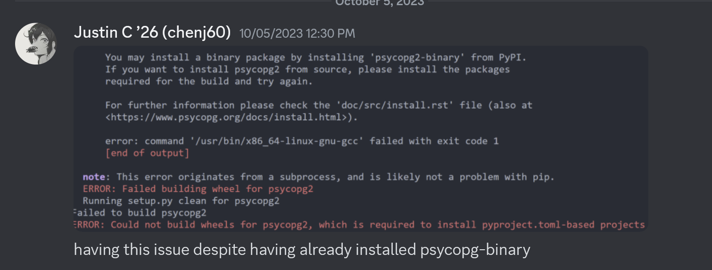
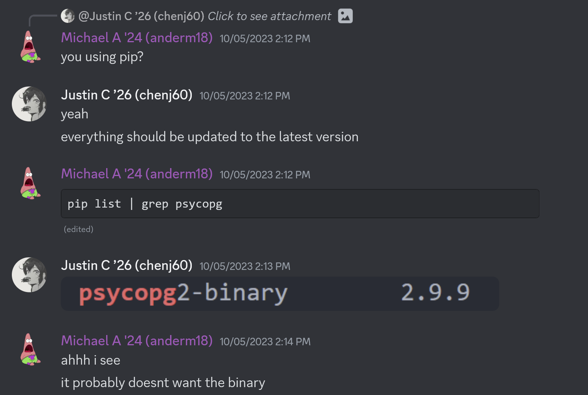
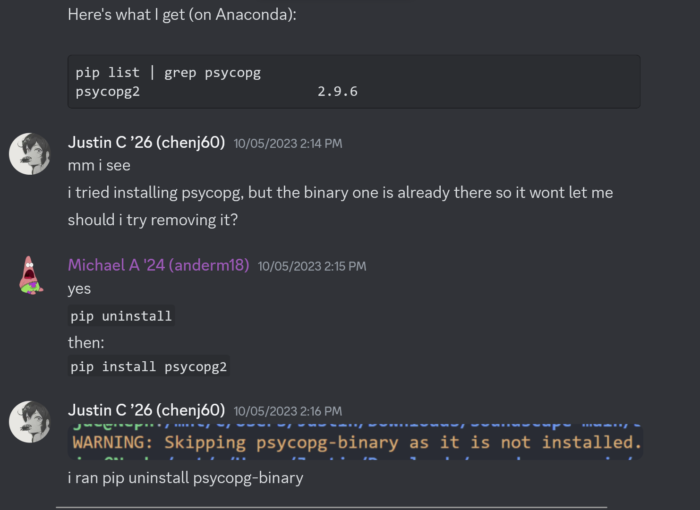
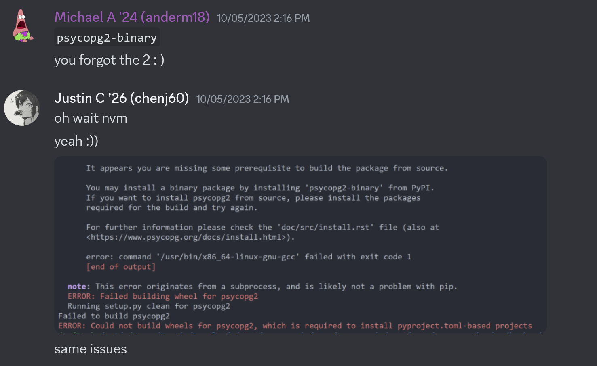
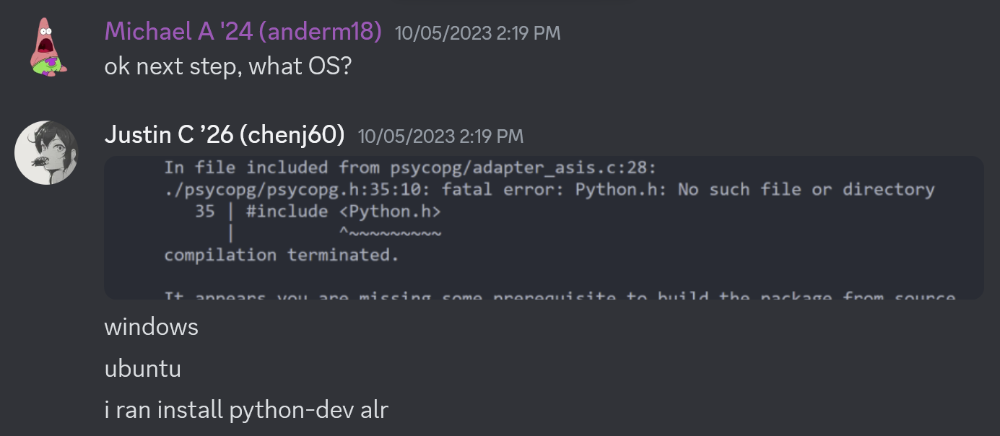
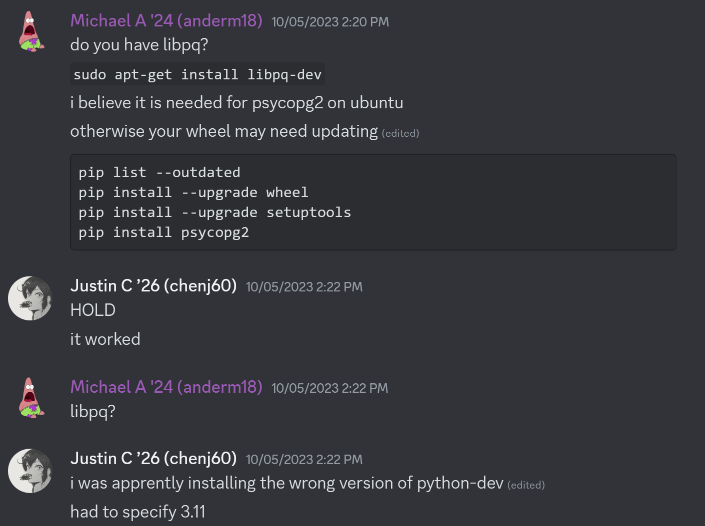

# Installation And Setup Process Documentation

## Table of Contents

- [Starting Out](#starting-out)
- [Backend](#backend)
  - [Issues &amp; Fixes](#issues--fixes)
    - [The infamous &#34;psycopg issue&#34;](#the-infamous-psycopg-issue)
    - [`ModuleNotFoundError: No module named 'azure'` issue](#modulenotfounderror-no-module-named-azure-issue)
    - [Having trouble changing default python versions](#having-trouble-changing-default-python-versions)
    - [`/email` error and others with backend server](#email-error-and-others-with-backend-server)
- [Frontend](#frontend)

## Starting Out

1. Clone [microsoft/soundscape](https://www.github.com/microsoft/soundscape)
   - We recommend making a fork on GitHub and then cloning that so that you have your own repository you have access to write to.
2. Follow the backend directions in `docs/authoring-web-client/onboarding.md`. (Now included down below and integrated with our alterations.)

## Backend

1. In the `/backend` folder, if there is no virtual environment (`.venv`), create one and select it as the default Python interpreter in VSCode. Run `python3 -m venv .venv`.
2. If the Python packages are not installed, run `pip install -r requirements.txt`.
3. Go to `backend/.env` and rename `example.env` to just `.env`
4. Fill in the needed properties as shown in the `.env` file.

   - set `DJANGO_SETTINGS_MODULE = "backend.settings.local"`
   - set `ENV = "local"`
   - set `AZURE_MAPS_SUBSCRIPTION_KEY = ""` as well; you'll need to get the key from someone (**DO NOT EVER COMMIT THIS KEY**)
   - set `DJANGO_SECRET_KEY=""` after receiving it from someone (**same as above do not commit**)

5a. Export all variables in the `.env` file. (**NEW WAY**)

- First, remove all the comments in the .env files and leave no empty spaces. It will have only the variables and their values. Also, put a new line (ENTER) after each variable. It should look like the following:
  ```
  ENV=production
  newline
  DJANGO_SETTINGS_MODULE=backend.settings.local
  ...
  ```
- Next, run this in the WSL terminal in the backend folder `export $(xargs <.env/local.env)`

5b. Export all variables in the '.env' file. (**OLD WAY**)

- set `DJANGO_SETTINGS_MODULE="backend.settings.local"` and run `export DJANGO_SETTINGS_MODULE="backend.settings.local"`
- set `ENV="local"` and run `export ENV="local"`
- set and export `AZURE_MAPS_SUBSCRIPTION_KEY=""` as well; you'll need to get the key from someone (DO NOT EVER COMMIT THIS KEY)
- set and export `DJANGO_SECRET_KEY=""` after receiving it from someone (same as above do not commit)
- set and export `X_MS_TOKEN_AAD_ID_TOKEN=""`. This key is unique to you and will be generated when you sign up on the Soundscape Community website (again, never commit).

6. Run:

   (**NOTE**: Google and install any modules that `python manage.py makemigrations` tells you cannot be found)

   1. `python manage.py makemigrations`
   2. `python manage.py makemigrations api`
   3. `python manage.py migrate`
7. In the folder `/backend/.env`:

   1. Create the files `local.env`, `development.env` and `production.env` (You can copy everything from the base .env into these)
8. Create a folder called `/.auth` in `/backend`.
9. Create a file called `me.json` in `/.auth` folder. This is the format with some dummy values:

```
[
   {
   "user_claims": [
      {
         "typ": "http://schemas.microsoft.com/identity/claims/objectidentifier",
         "val": "123vhjvjh45"
      },
      {
         "typ": "http://schemas.xmlsoap.org/ws/2005/05/identity/claims/emailaddress",
         "val": "users@example.com" 
      },
      {
         "typ": "name",
         "val": "John Doe" 
      },
      {
         "typ": "preferred_username",
         "val": "johndoe" 
      }
   ],
   "id_token": "some_id_token_value"
   }
]
```

10. To run the backend server, run `python manage.py runserver`.
11. Navigate out of `/backend` and over to `/frontend`.

### Issues & Fixes

#### The infamous _"psycopg issue"_

This is for Windows Ubuntu.








#### `ModuleNotFoundError: No module named 'azure'` issue

As best as we can tell, something is probably wrong or missing when you created your virtual environment (`.venv`). Try deleting that folder and recreating it. Make sure to wait until the command is finished running and exists out on its own. After that try redoing the [backend instructions](#backend) and you shouldn't run into this problem again.

**TIP**: Also double check what python versions you may be using. The original onboarding document uses `python3` for generating the `.venv` directory - make sure that the python version for that matches with `python` (just check that `python3 --version` and `python --version` both output the same version).

#### Having trouble changing default python versions

[Check this out](https://unix.stackexchange.com/questions/410579/change-the-python3-default-version-in-ubuntu)

#### `/email` error and others with backend server

Once you've got the backend server up and running, you may open it and find that it's giving you an issue specifically in the `backend/backend/middleware/UserParseMiddleware.py` file. Remember those dummy values in `/.auth/me.json`? Just plug in those values after the `=` sign for whichever attributes the server is giving you trouble with.

## Frontend

1. Run `npm install` and then `npm run start` to run the website

   **NOTE**: Google and install any modules that `python manage.py makemigrations` tells you cannot be found

   1. If you see a bunch of vulnerabilities you can run `npm audit fix --force` until you have 8 vulnerabilities instead (Looks kinda like this: `"131 vulnerabilities (1 low, 104 moderate, 22 high, 4 critical)"`
2. Follow the instruction [here](https://tailwindcss.com/docs/installation) to install Tailwind CSS.

   1. For step 2 of the guide, your head CSS file is located at `"./src/index.css"`
   2. For step 4 of the guide, replace "input.css" and "output.css" with "index.css"
   3. For step 5, add `<link href="/dist/output.css" rel="stylesheet">` to `"/public/index.html"
   4. If you come across a key error, modify `user_email = request.aad_user.get('email', ' ').lower() `to `user_email="some stirng"`
   5. If you come across an authentication/access error, at the time of writing, simply comment out the processing statements for authentication (the following two if-statements)

## Development

1. Run python manage.py runserver
2. For API request errors (temporary workaround):
   1. Make sure you are using local development (local.env)
   2. In `api/views.py`, in all instances of `user_id = self.request.aad_user['id']`, set user_id to a random string
   3. Run server again. API errors should be resovled.
