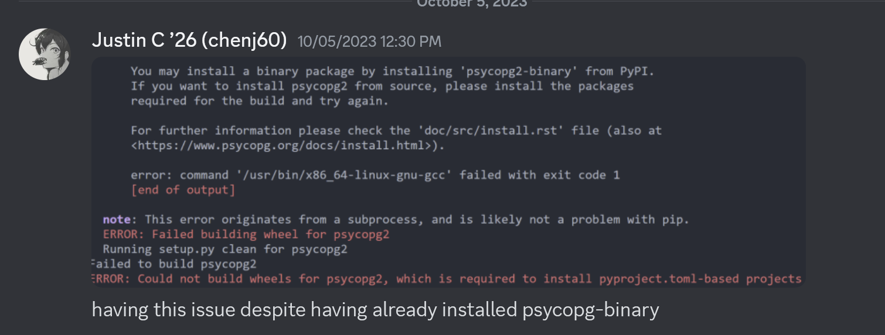
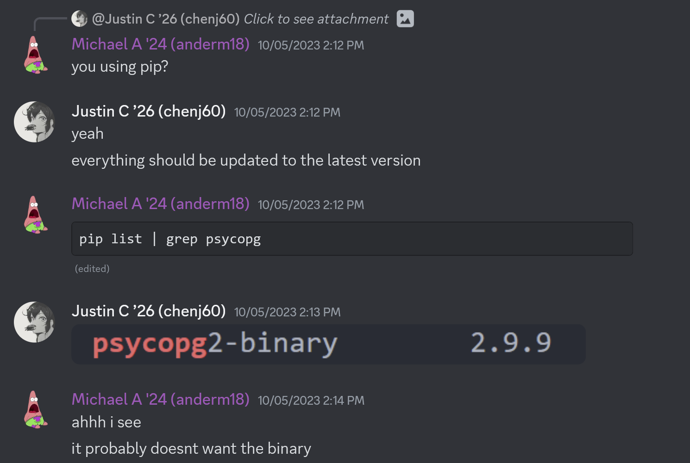
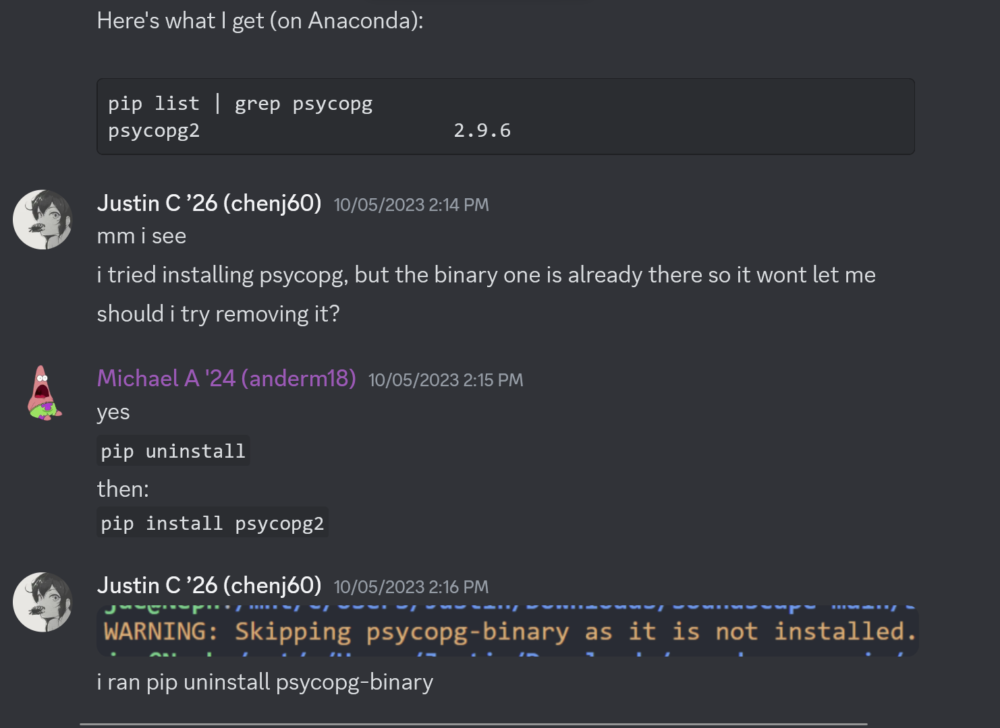
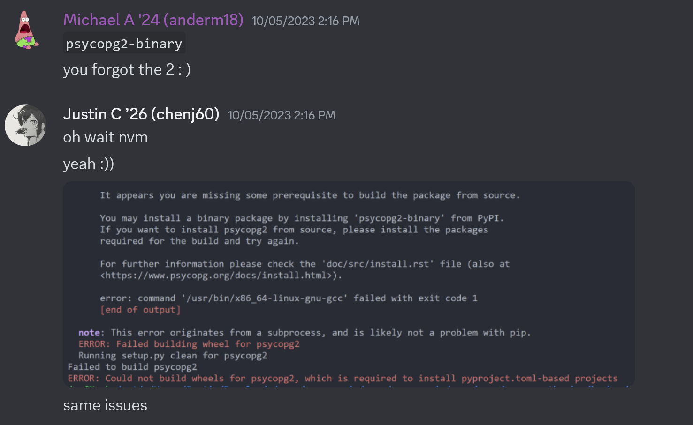
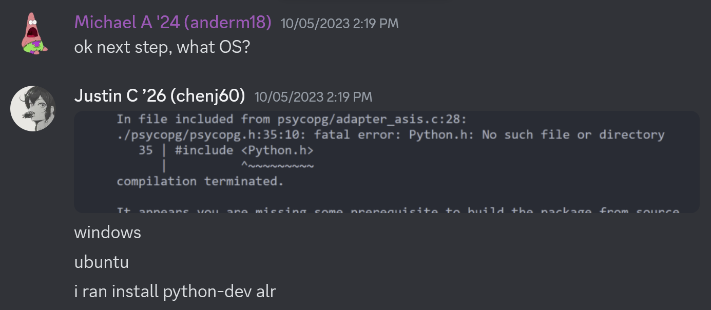
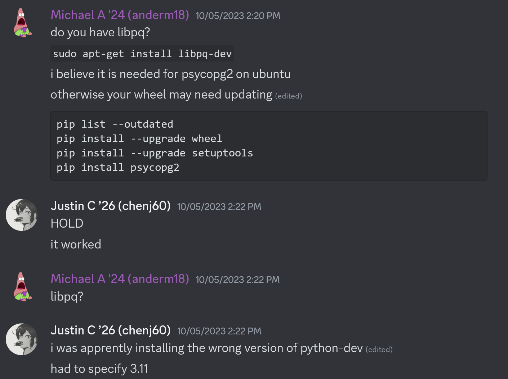

# Installation And Setup

1. Clone [microsoft/soundscape](https://www.github.com/microsoft/soundscape)
   - We recommend making a fork on GitHub and then cloning that so that you have your own repository you have access to write to.
- Follow the backend directions in `docs/authoring-web-client/onboarding.md`. (Now included down below and integrated with our alterations.)

## Backend

1. In the `/backend` folder, if there is no virtual environment (`.venv`), create one and select it as the default Python interpreter in VSCode. Run `python3 -m venv .venv`.

2. If the Python packages are not installed, run `pip install -r requirements.txt`.

3. Go to `backend/.env` and rename `example.env` to just `.env`

4. Fill in the needed properties as shown in the `.env` file.

   - set `DJANGO_SETTINGS_MODULE = "backend.settings.local"` and run `export DJANGO_SETTINGS_MODULE="backend.settings.local"`
   - set `ENV = "local"` and run `export ENV="local"`
   - set and export `AZURE_MAPS_SUBSCRIPTION_KEY = ""` as well; you'll need to get the key from someone (**DO NOT EVER COMMIT THIS KEY**)
   - set and export `DJANGO_SECRET_KEY=""` after receiving it from someone (**same as above do not commit**)
5. Run:

   (**NOTE**: Google and install any modules that `python manage.py makemigrations` tells you cannot be found)

   1. `python manage.py makemigrations`
   2. `python manage.py makemigrations api`
   3. `python manage.py migrate`
6. In the folder `/backend/.env`:

   1. Create the files `local.env`, `development.env` and `production.env` (You can copy everything from the base .env into these)

7. Create a folder called `/.auth` in `/backend`.

8. Create a file called `me.json` in `/.auth` folder. This is the format with some dummy values:

```
[
   {
   "user_claims": [
      {
         "typ": "http://schemas.microsoft.com/identity/claims/objectidentifier",
         "val": "123vhjvjh45"
      },
      {
         "typ": "http://schemas.xmlsoap.org/ws/2005/05/identity/claims/emailaddress",
         "val": "users@example.com" 
      },
      {
         "typ": "name",
         "val": "John Doe" 
      },
      {
         "typ": "preferred_username",
         "val": "johndoe" 
      }
   ],
   "id_token": "some_id_token_value"
   }
]
```

9. Navigate out of `/backend` and over to `/frontend`.

### Issues & Fixes

#### The infamous "psycopg issue"
This is for Windows Ubuntu.








## Frontend

1. Run `npm install` and then `npm run start` to run the website
   
    **NOTE**: Google and install any modules that `python manage.py makemigrations` tells you cannot be found

    1. If you see a bunch of vulnerabilities you can run `npm audit fix --force` until you have 8 vulnerabilities instead (Looks kinda like this: `"131 vulnerabilities (1 low, 104 moderate, 22 high, 4 critical)"`

2. Follow the instruction [here](https://tailwindcss.com/docs/installation) to install Tailwind CSS.

    1. For step 2 of the guide, your head CSS file is located at `"./src/index.css"`
    2. For step 4 of the guide, replace "input.css" and "output.css" with "index.css"
    3. For step 5, add `<link href="/dist/output.css" rel="stylesheet">` to `"/public/index.html"`
